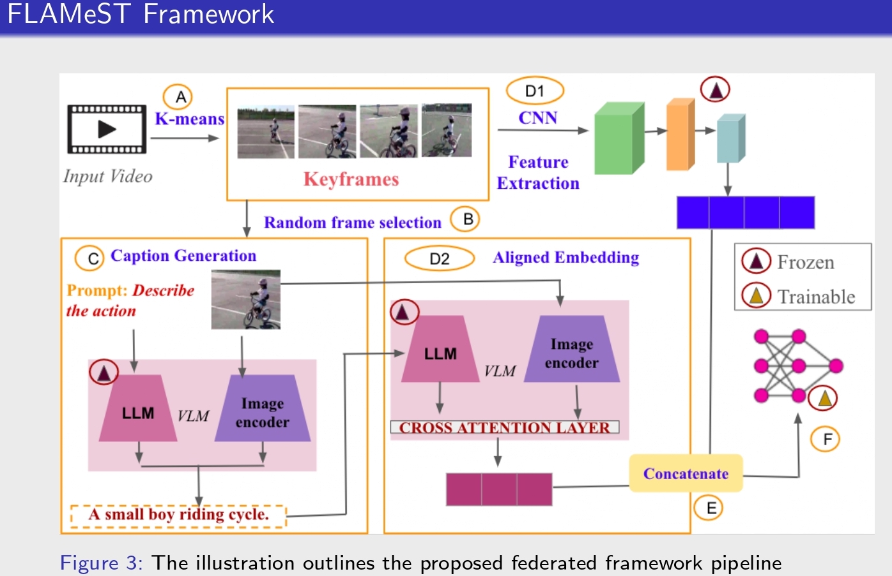

# FLAMeST: Federated Multimodal Fusion for Video Action Recognition

Federated Learning (FL) for Video Action Recognition (VAR) faces significant challenges in balancing **privacy preservation**, **communication efficiency**, and **model performance**.

This work introduces **FLAMeST** (*Federated Learning for Action Recognition with Multimodal Embeddings and Spatio-Temporal Fusion*), an FL framework that synergizes **Vision–Language Models (VLMs)** and **spatiotemporal CNNs** to address these challenges.

## Key Idea
Unlike existing methods that use **BLIP** solely for caption generation, **FLAMeST leverages BLIP in a dual manner** to obtain semantic representations. To enhance temporal modeling, complementary spatiotemporal features are extracted using a pre-trained **3D CNN (Slow network)**. The **semantic (BLIP)** and **motion (Slow)** embeddings are concatenated into a unified representation and used to train a lightweight **Multi-Layer Perceptron (MLP)** classifier.

## Privacy & Communication Efficiency
Within the federated learning paradigm, **only the MLP parameters are shared with the server**, ensuring that **raw videos and generated captions remain local**. FLAMeST employs **FedAvg** for aggregation and achieves approximately **99% lower communication overhead** compared to full-model federated training.

## Results
Experiments on **UCF101** and **HMDB51** demonstrate robustness and performance gains, achieving improvements of:

- **+5.13%** on **UCF101**
- **+2.71%** on **HMDB51**

compared to the baseline.

  

---

> **Note:** This repository contains the implementation and experiments for the FLAMeST framework.
